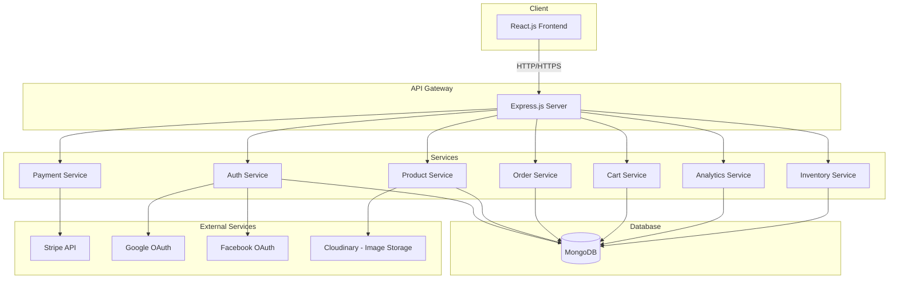
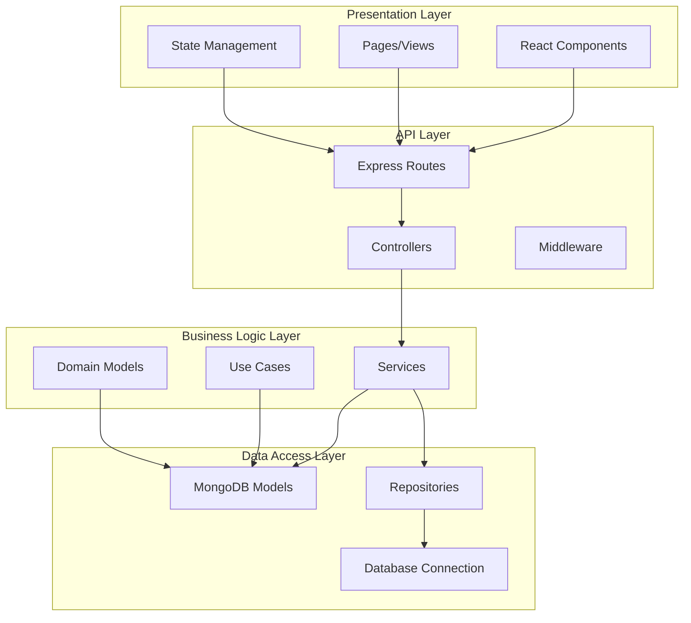
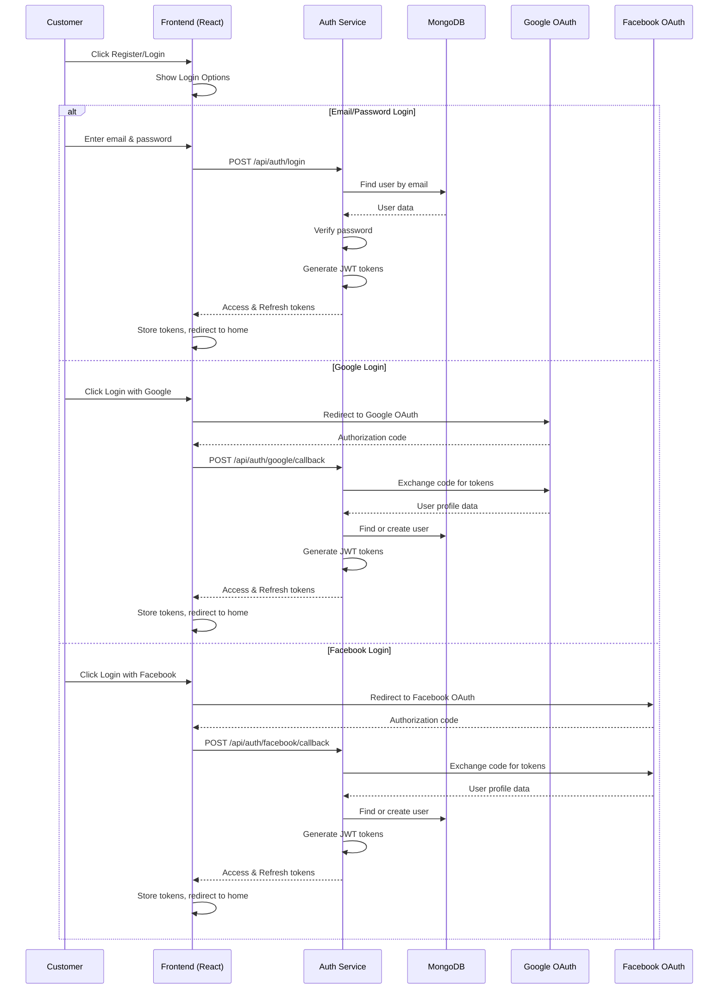
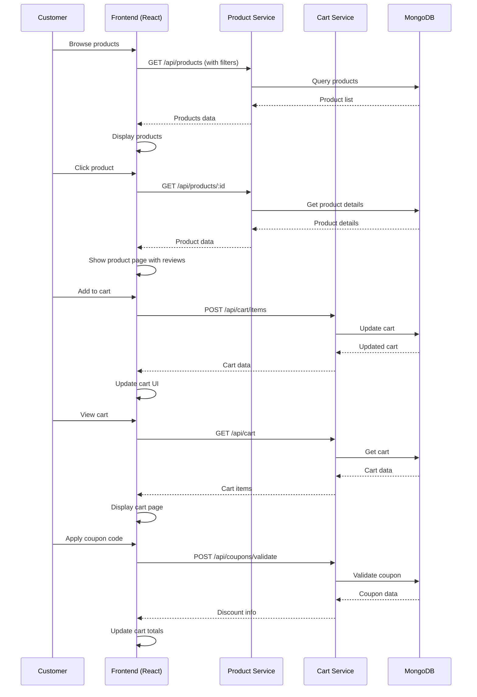
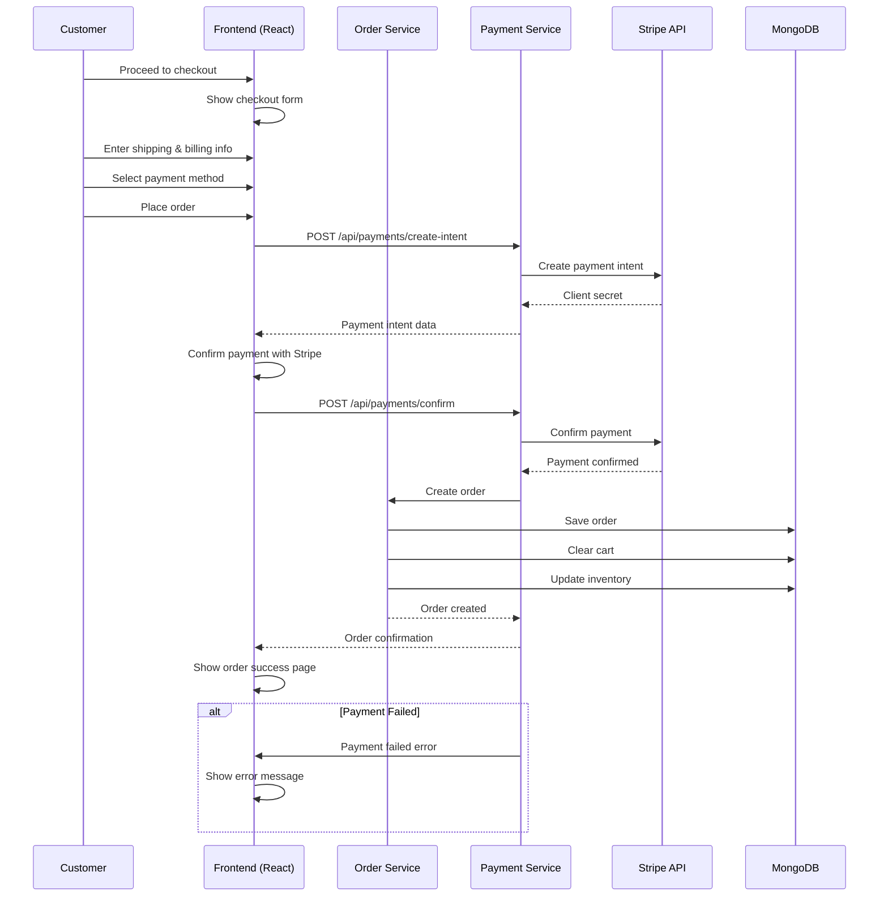
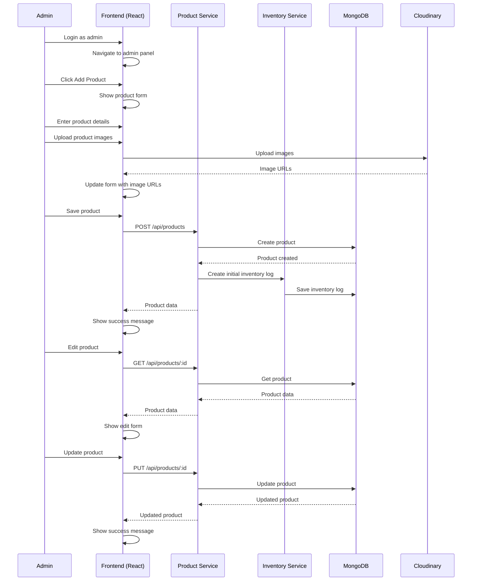
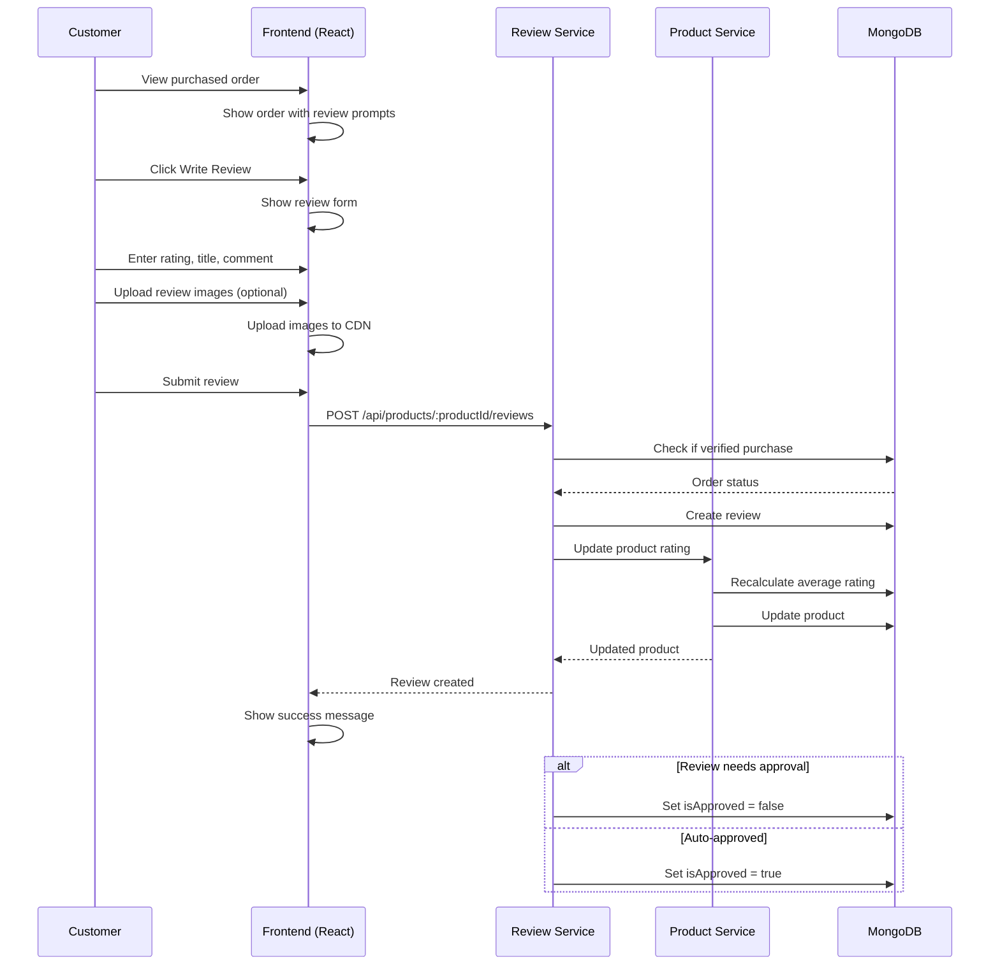

# MERN Stack E-commerce Application - Architecture Plan

## Project Overview

A full-featured e-commerce web application built with MERN stack (MongoDB, Express.js, React.js, Node.js) following clean architecture principles.

### Tech Stack
- **Frontend**: React.js (Client-side rendering)
- **Backend**: Node.js + Express.js
- **Database**: MongoDB (NoSQL)
- **Authentication**: JWT + Social Login (Google, Facebook)
- **Payment Gateway**: Stripe
- **API Style**: REST APIs

---

## System Architecture

### High-Level Architecture



### Clean Architecture Layers



---

## Database Schema (MongoDB)

### User Collection
```javascript
{
  _id: ObjectId,
  email: String (unique, required),
  password: String (hashed),
  firstName: String,
  lastName: String,
  avatar: String,
  role: String (enum: ['customer', 'admin', 'super_admin']),
  isEmailVerified: Boolean,
  socialAccounts: [{
    provider: String (enum: ['google', 'facebook']),
    providerId: String,
    avatar: String
  }],
  addresses: [{
    street: String,
    city: String,
    state: String,
    zipCode: String,
    country: String,
    isDefault: Boolean
  }],
  createdAt: Date,
  updatedAt: Date
}
```

### Product Collection
```javascript
{
  _id: ObjectId,
  name: String (required),
  slug: String (unique, required),
  description: String,
  shortDescription: String,
  category: ObjectId (ref: Category),
  subcategory: ObjectId (ref: Subcategory),
  brand: String,
  images: [String],
  price: Number (required),
  compareAtPrice: Number,
  costPrice: Number,
  sku: String (unique),
  stock: Number (default: 0),
  lowStockThreshold: Number (default: 10),
  attributes: [{
    name: String,
    value: String
  }],
  variants: [{
    name: String,
    options: [{
      name: String,
      value: String,
      priceModifier: Number,
      sku: String,
      stock: Number
    }]
  }],
  tags: [String],
  isActive: Boolean (default: true),
  isFeatured: Boolean (default: false),
  averageRating: Number (default: 0),
  reviewCount: Number (default: 0),
  createdAt: Date,
  updatedAt: Date
}
```

### Category Collection
```javascript
{
  _id: ObjectId,
  name: String (required, unique),
  slug: String (unique, required),
  description: String,
  image: String,
  parentId: ObjectId (ref: Category),
  isActive: Boolean (default: true),
  order: Number,
  createdAt: Date,
  updatedAt: Date
}
```

### Order Collection
```javascript
{
  _id: ObjectId,
  orderNumber: String (unique),
  userId: ObjectId (ref: User),
  items: [{
    productId: ObjectId (ref: Product),
    variantId: ObjectId,
    name: String,
    image: String,
    quantity: Number,
    price: Number,
    totalPrice: Number
  }],
  subtotal: Number,
  shippingCost: Number,
  tax: Number,
  discount: Number,
  total: Number,
  currency: String (default: 'USD'),
  status: String (enum: ['pending', 'confirmed', 'processing', 'shipped', 'delivered', 'cancelled', 'refunded']),
  paymentStatus: String (enum: ['pending', 'paid', 'failed', 'refunded']),
  paymentMethod: String,
  paymentId: String,
  shippingAddress: {
    street: String,
    city: String,
    state: String,
    zipCode: String,
    country: String,
    phone: String
  },
  billingAddress: {
    street: String,
    city: String,
    state: String,
    zipCode: String,
    country: String,
    phone: String
  },
  trackingNumber: String,
  notes: String,
  createdAt: Date,
  updatedAt: Date
}
```

### Cart Collection
```javascript
{
  _id: ObjectId,
  userId: ObjectId (ref: User, unique),
  sessionId: String,
  items: [{
    productId: ObjectId (ref: Product),
    variantId: ObjectId,
    quantity: Number,
    price: Number
  }],
  createdAt: Date,
  updatedAt: Date
}
```

### Wishlist Collection
```javascript
{
  _id: ObjectId,
  userId: ObjectId (ref: User, unique),
  items: [{
    productId: ObjectId (ref: Product),
    addedAt: Date
  }],
  createdAt: Date,
  updatedAt: Date
}
```

### Review Collection
```javascript
{
  _id: ObjectId,
  userId: ObjectId (ref: User),
  productId: ObjectId (ref: Product),
  orderId: ObjectId (ref: Order),
  rating: Number (min: 1, max: 5),
  title: String,
  comment: String,
  images: [String],
  isVerifiedPurchase: Boolean,
  isApproved: Boolean (default: false),
  helpfulCount: Number (default: 0),
  createdAt: Date,
  updatedAt: Date
}
```

### Coupon Collection
```javascript
{
  _id: ObjectId,
  code: String (unique, required),
  type: String (enum: ['percentage', 'fixed']),
  value: Number,
  minOrderAmount: Number,
  maxDiscountAmount: Number,
  usageLimit: Number,
  usedCount: Number (default: 0),
  validFrom: Date,
  validUntil: Date,
  applicableCategories: [ObjectId],
  applicableProducts: [ObjectId],
  isActive: Boolean (default: true),
  createdAt: Date,
  updatedAt: Date
}
```

### InventoryLog Collection
```javascript
{
  _id: ObjectId,
  productId: ObjectId (ref: Product),
  variantId: ObjectId,
  type: String (enum: ['in', 'out', 'adjustment']),
  quantity: Number,
  reason: String,
  referenceId: ObjectId,
  referenceType: String,
  previousStock: Number,
  newStock: Number,
  createdAt: Date
}
```

### Analytics Collection
```javascript
{
  _id: ObjectId,
  date: Date,
  metrics: {
    totalOrders: Number,
    totalRevenue: Number,
    totalCustomers: Number,
    averageOrderValue: Number,
    conversionRate: Number,
    topProducts: [{
      productId: ObjectId,
      name: String,
      salesCount: Number,
      revenue: Number
    }],
    topCategories: [{
      categoryId: ObjectId,
      name: String,
      salesCount: Number,
      revenue: Number
    }]
  },
  createdAt: Date
}
```

---

## REST API Endpoints

### Authentication Endpoints

| Method | Endpoint | Description | Auth Required |
|--------|----------|-------------|---------------|
| POST | `/api/auth/register` | Register new user | No |
| POST | `/api/auth/login` | User login | No |
| POST | `/api/auth/logout` | User logout | Yes |
| POST | `/api/auth/refresh` | Refresh access token | No |
| POST | `/api/auth/forgot-password` | Request password reset | No |
| POST | `/api/auth/reset-password` | Reset password | No |
| GET | `/api/auth/google` | Initiate Google OAuth | No |
| GET | `/api/auth/google/callback` | Google OAuth callback | No |
| GET | `/api/auth/facebook` | Initiate Facebook OAuth | No |
| GET | `/api/auth/facebook/callback` | Facebook OAuth callback | No |
| GET | `/api/auth/me` | Get current user | Yes |
| PUT | `/api/auth/me` | Update current user | Yes |
| PUT | `/api/auth/change-password` | Change password | Yes |

### Product Endpoints

| Method | Endpoint | Description | Auth Required |
|--------|----------|-------------|---------------|
| GET | `/api/products` | List products (with pagination, filters) | No |
| GET | `/api/products/:id` | Get product by ID | No |
| GET | `/api/products/slug/:slug` | Get product by slug | No |
| GET | `/api/products/featured` | Get featured products | No |
| GET | `/api/products/search` | Search products | No |
| POST | `/api/products` | Create product | Admin |
| PUT | `/api/products/:id` | Update product | Admin |
| DELETE | `/api/products/:id` | Delete product | Admin |
| PATCH | `/api/products/:id/stock` | Update product stock | Admin |

### Category Endpoints

| Method | Endpoint | Description | Auth Required |
|--------|----------|-------------|---------------|
| GET | `/api/categories` | List categories | No |
| GET | `/api/categories/:id` | Get category by ID | No |
| GET | `/api/categories/:slug/products` | Get products by category | No |
| POST | `/api/categories` | Create category | Admin |
| PUT | `/api/categories/:id` | Update category | Admin |
| DELETE | `/api/categories/:id` | Delete category | Admin |

### Cart Endpoints

| Method | Endpoint | Description | Auth Required |
|--------|----------|-------------|---------------|
| GET | `/api/cart` | Get user cart | Yes |
| POST | `/api/cart/items` | Add item to cart | Yes |
| PUT | `/api/cart/items/:itemId` | Update cart item quantity | Yes |
| DELETE | `/api/cart/items/:itemId` | Remove item from cart | Yes |
| DELETE | `/api/cart` | Clear cart | Yes |
| POST | `/api/cart/merge` | Merge guest cart to user cart | Yes |

### Wishlist Endpoints

| Method | Endpoint | Description | Auth Required |
|--------|----------|-------------|---------------|
| GET | `/api/wishlist` | Get user wishlist | Yes |
| POST | `/api/wishlist/items` | Add item to wishlist | Yes |
| DELETE | `/api/wishlist/items/:productId` | Remove item from wishlist | Yes |
| DELETE | `/api/wishlist` | Clear wishlist | Yes |
| POST | `/api/wishlist/move-to-cart` | Move item to cart | Yes |

### Order Endpoints

| Method | Endpoint | Description | Auth Required |
|--------|----------|-------------|---------------|
| GET | `/api/orders` | List user orders | Yes |
| GET | `/api/orders/:id` | Get order by ID | Yes |
| POST | `/api/orders` | Create order | Yes |
| POST | `/api/orders/:id/cancel` | Cancel order | Yes |
| GET | `/api/orders/:id/track` | Track order | Yes |
| GET | `/api/admin/orders` | List all orders (admin) | Admin |
| PUT | `/api/admin/orders/:id/status` | Update order status | Admin |
| PUT | `/api/admin/orders/:id/tracking` | Add tracking info | Admin |

### Payment Endpoints

| Method | Endpoint | Description | Auth Required |
|--------|----------|-------------|---------------|
| POST | `/api/payments/create-intent` | Create Stripe payment intent | Yes |
| POST | `/api/payments/confirm` | Confirm payment | Yes |
| POST | `/api/payments/webhook` | Stripe webhook handler | No |
| GET | `/api/payments/:orderId` | Get payment status | Yes |

### Review Endpoints

| Method | Endpoint | Description | Auth Required |
|--------|----------|-------------|---------------|
| GET | `/api/products/:productId/reviews` | Get product reviews | No |
| POST | `/api/products/:productId/reviews` | Create review | Yes |
| PUT | `/api/reviews/:id` | Update review | Yes (owner) |
| DELETE | `/api/reviews/:id` | Delete review | Yes (owner) |
| POST | `/api/reviews/:id/helpful` | Mark review as helpful | Yes |
| GET | `/api/admin/reviews` | List all reviews (admin) | Admin |
| PUT | `/api/admin/reviews/:id/approve` | Approve review | Admin |

### Coupon Endpoints

| Method | Endpoint | Description | Auth Required |
|--------|----------|-------------|---------------|
| POST | `/api/coupons/validate` | Validate coupon code | Yes |
| GET | `/api/admin/coupons` | List all coupons | Admin |
| POST | `/api/admin/coupons` | Create coupon | Admin |
| PUT | `/api/admin/coupons/:id` | Update coupon | Admin |
| DELETE | `/api/admin/coupons/:id` | Delete coupon | Admin |

### Inventory Endpoints

| Method | Endpoint | Description | Auth Required |
|--------|----------|-------------|---------------|
| GET | `/api/admin/inventory` | Get inventory overview | Admin |
| GET | `/api/admin/inventory/logs` | Get inventory logs | Admin |
| POST | `/api/admin/inventory/adjust` | Adjust inventory | Admin |
| POST | `/api/admin/inventory/bulk-update` | Bulk update inventory | Admin |

### Analytics Endpoints

| Method | Endpoint | Description | Auth Required |
|--------|----------|-------------|---------------|
| GET | `/api/admin/analytics/dashboard` | Get dashboard analytics | Admin |
| GET | `/api/admin/analytics/sales` | Get sales analytics | Admin |
| GET | `/api/admin/analytics/products` | Get product analytics | Admin |
| GET | `/api/admin/analytics/customers` | Get customer analytics | Admin |
| GET | `/api/admin/analytics/reports` | Generate reports | Admin |

---

## User Workflows

### Customer Registration & Login Flow



### Product Browsing & Shopping Flow



### Checkout & Payment Flow



### Admin Product Management Flow



### Review & Rating Flow



---

## Project Structure

```
mern-ecommerce/
├── client/                          # React.js Frontend
│   ├── public/
│   │   ├── index.html
│   │   └── favicon.ico
│   ├── src/
│   │   ├── assets/                 # Static assets
│   │   ├── components/             # Reusable components
│   │   │   ├── common/            # Common UI components
│   │   │   │   ├── Button.jsx
│   │   │   │   ├── Input.jsx
│   │   │   │   ├── Modal.jsx
│   │   │   │   ├── Card.jsx
│   │   │   │   └── ...
│   │   │   ├── layout/            # Layout components
│   │   │   │   ├── Header.jsx
│   │   │   │   ├── Footer.jsx
│   │   │   │   ├── Sidebar.jsx
│   │   │   │   └── ...
│   │   │   ├── product/           # Product-related components
│   │   │   │   ├── ProductCard.jsx
│   │   │   │   ├── ProductGrid.jsx
│   │   │   │   ├── ProductFilter.jsx
│   │   │   │   └── ...
│   │   │   ├── cart/              # Cart components
│   │   │   │   ├── CartItem.jsx
│   │   │   │   ├── CartSummary.jsx
│   │   │   │   └── ...
│   │   │   └── auth/              # Auth components
│   │   │       ├── LoginForm.jsx
│   │   │       ├── RegisterForm.jsx
│   │   │       └── ...
│   │   ├── pages/                  # Page components
│   │   │   ├── Home.jsx
│   │   │   ├── Products.jsx
│   │   │   ├── ProductDetail.jsx
│   │   │   ├── Cart.jsx
│   │   │   ├── Checkout.jsx
│   │   │   ├── Orders.jsx
│   │   │   ├── OrderDetail.jsx
│   │   │   ├── Profile.jsx
│   │   │   ├── Wishlist.jsx
│   │   │   ├── Login.jsx
│   │   │   ├── Register.jsx
│   │   │   └── admin/
│   │   │       ├── Dashboard.jsx
│   │   │       ├── ProductsAdmin.jsx
│   │   │       ├── OrdersAdmin.jsx
│   │   │       ├── CustomersAdmin.jsx
│   │   │       ├── AnalyticsAdmin.jsx
│   │   │       └── InventoryAdmin.jsx
│   │   ├── context/                # React Context
│   │   │   ├── AuthContext.jsx
│   │   │   ├── CartContext.jsx
│   │   │   └── ThemeContext.jsx
│   │   ├── hooks/                  # Custom hooks
│   │   │   ├── useAuth.js
│   │   │   ├── useCart.js
│   │   │   ├── useProducts.js
│   │   │   └── ...
│   │   ├── services/               # API services
│   │   │   ├── api.js             # Axios instance
│   │   │   ├── authService.js
│   │   │   ├── productService.js
│   │   │   ├── cartService.js
│   │   │   ├── orderService.js
│   │   │   └── ...
│   │   ├── utils/                  # Utility functions
│   │   │   ├── validators.js
│   │   │   ├── formatters.js
│   │   │   └── constants.js
│   │   ├── App.jsx
│   │   └── index.js
│   ├── package.json
│   └── .env
│
├── server/                          # Node.js + Express Backend
│   ├── src/
│   │   ├── config/                 # Configuration
│   │   │   ├── database.js
│   │   │   ├── cloudinary.js
│   │   │   ├── stripe.js
│   │   │   └── passport.js
│   │   ├── controllers/            # Route controllers
│   │   │   ├── authController.js
│   │   │   ├── productController.js
│   │   │   ├── cartController.js
│   │   │   ├── orderController.js
│   │   │   ├── paymentController.js
│   │   │   ├── reviewController.js
│   │   │   ├── couponController.js
│   │   │   ├── inventoryController.js
│   │   │   └── analyticsController.js
│   │   ├── middleware/             # Express middleware
│   │   │   ├── auth.js
│   │   │   ├── errorHandler.js
│   │   │   ├── validation.js
│   │   │   ├── rateLimiter.js
│   │   │   └── upload.js
│   │   ├── models/                 # Mongoose models
│   │   │   ├── User.js
│   │   │   ├── Product.js
│   │   │   ├── Category.js
│   │   │   ├── Order.js
│   │   │   ├── Cart.js
│   │   │   ├── Wishlist.js
│   │   │   ├── Review.js
│   │   │   ├── Coupon.js
│   │   │   └── Analytics.js
│   │   ├── routes/                 # API routes
│   │   │   ├── auth.js
│   │   │   ├── products.js
│   │   │   ├── categories.js
│   │   │   ├── cart.js
│   │   │   ├── wishlist.js
│   │   │   ├── orders.js
│   │   │   ├── payments.js
│   │   │   ├── reviews.js
│   │   │   ├── coupons.js
│   │   │   ├── inventory.js
│   │   │   └── analytics.js
│   │   ├── services/               # Business logic services
│   │   │   ├── authService.js
│   │   │   ├── productService.js
│   │   │   ├── cartService.js
│   │   │   ├── orderService.js
│   │   │   ├── paymentService.js
│   │   │   ├── reviewService.js
│   │   │   ├── couponService.js
│   │   │   ├── inventoryService.js
│   │   │   └── analyticsService.js
│   │   ├── validators/             # Request validators
│   │   │   ├── authValidator.js
│   │   │   ├── productValidator.js
│   │   │   ├── orderValidator.js
│   │   │   └── ...
│   │   ├── utils/                  # Utility functions
│   │   │   ├── jwt.js
│   │   │   ├── errors.js
│   │   │   └── helpers.js
│   │   └── app.js                  # Express app
│   ├── package.json
│   └── .env
│
├── shared/                          # Shared types/constants
│   └── constants/
│       └── index.js
│
├── .gitignore
├── docker-compose.yml
├── Dockerfile
└── README.md
```

---

## Key Features Implementation Details

### 1. Authentication (JWT + Social Login)
- **JWT Strategy**: Access tokens (15 min) + Refresh tokens (7 days)
- **Social Login**: OAuth 2.0 with Google and Facebook
- **Password Security**: bcrypt with salt rounds (10)
- **Email Verification**: Send verification email on registration

### 2. Product Management
- **Image Upload**: Cloudinary CDN integration
- **Search & Filter**: MongoDB text search + multi-field filtering
- **Pagination**: Cursor-based pagination for performance
- **Caching**: Redis cache for frequently accessed products

### 3. Shopping Cart
- **Guest Cart**: Session-based cart for unauthenticated users
- **Cart Merge**: Merge guest cart to user cart on login
- **Real-time Updates**: WebSocket for cart synchronization

### 4. Payment Integration (Stripe)
- **Payment Intents**: Stripe Payment Intents API
- **Webhooks**: Handle payment success/failure events
- **Refunds**: Support for partial and full refunds

### 5. Order Management
- **Order Status Flow**: pending → confirmed → processing → shipped → delivered
- **Order Tracking**: Generate tracking number, integrate with shipping providers
- **Email Notifications**: Send order confirmation, shipping updates

### 6. Reviews & Ratings
- **Verified Purchase**: Only allow reviews from verified purchases
- **Moderation**: Admin approval required for reviews
- **Helpful Votes**: Allow users to vote on helpful reviews

### 7. Inventory Management
- **Stock Tracking**: Real-time stock updates
- **Low Stock Alerts**: Notify admin when stock below threshold
- **Inventory Logs**: Track all stock movements

### 8. Analytics Dashboard
- **Sales Metrics**: Revenue, orders, AOV, conversion rate
- **Product Analytics**: Top-selling products, low stock items
- **Customer Analytics**: New customers, repeat purchase rate
- **Reports**: Export daily/weekly/monthly reports

---

## Security Considerations

1. **Authentication & Authorization**
   - JWT tokens with secure storage (httpOnly cookies)
   - Role-based access control (RBAC)
   - Password hashing with bcrypt

2. **API Security**
   - Rate limiting to prevent abuse
   - Input validation and sanitization
   - CORS configuration
   - Helmet.js for security headers

3. **Data Protection**
   - HTTPS only in production
   - Environment variables for sensitive data
   - Database encryption at rest
   - Regular security audits

4. **Payment Security**
   - PCI DSS compliance through Stripe
   - Never store full card details
   - Secure webhook signature verification

---

## Deployment Strategy

### Development Environment
- Local MongoDB instance
- Hot reload with nodemon & react-scripts
- Environment-specific configurations

### Production Environment
- **Frontend**: Vercel / Netlify
- **Backend**: Heroku / AWS EC2 / DigitalOcean
- **Database**: MongoDB Atlas
- **Images**: Cloudinary CDN
- **CI/CD**: GitHub Actions

---

## Next Steps

This architecture plan provides a comprehensive foundation for building the e-commerce application. The following steps will be executed to implement this plan:

1. Set up project structure and initialize repositories
2. Configure database connection and create models
3. Implement authentication system
4. Build core API endpoints
5. Develop frontend components and pages
6. Integrate third-party services (Stripe, Cloudinary, OAuth)
7. Implement admin panel and analytics
8. Add testing and documentation
9. Deploy to production

---

**Document Version**: 1.0  
**Last Updated**: 2026-02-11  
**Status**: Ready for Implementation
