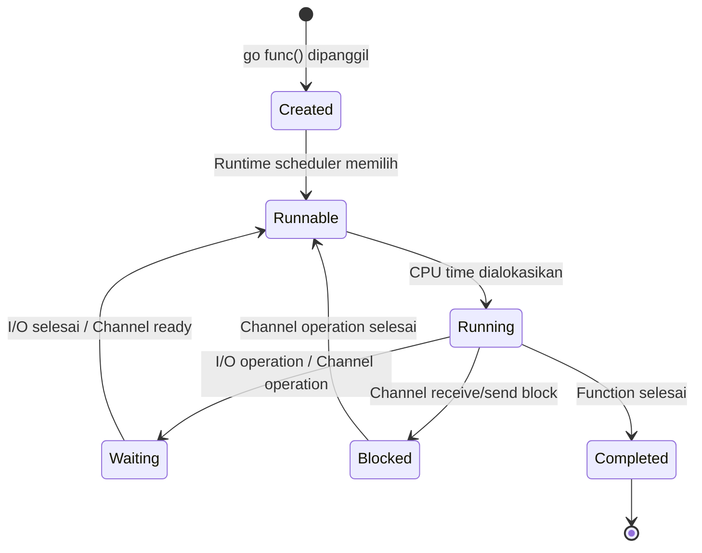
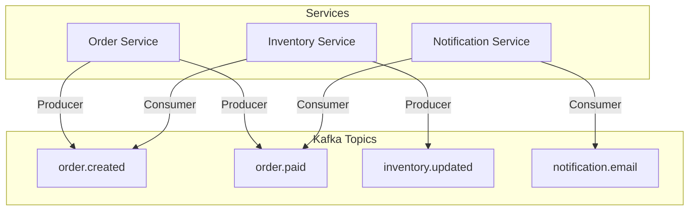
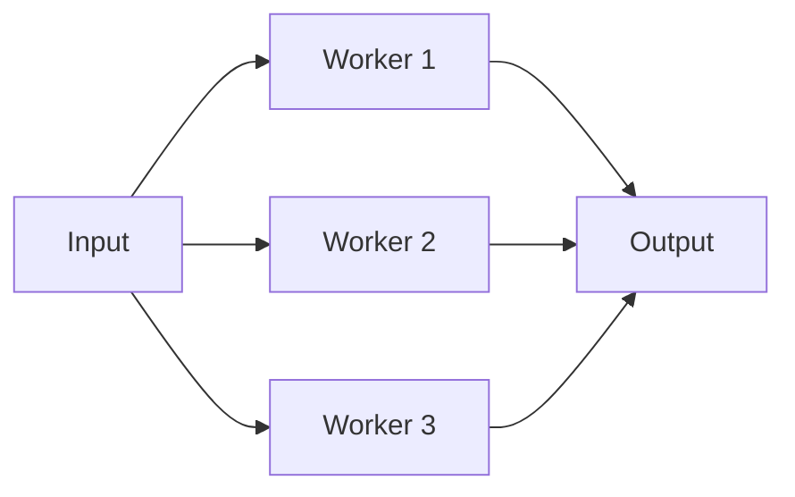
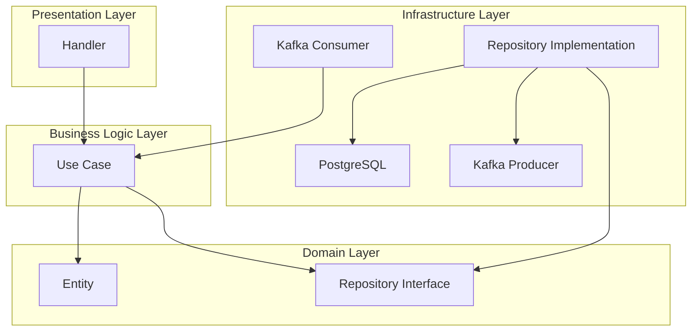
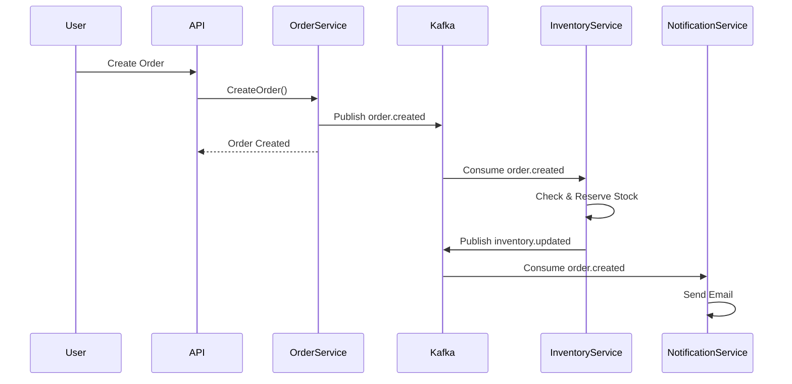

# Small E-Commerce Architecture Document

## Project Overview

**Project Name:** Small E-Commerce  
**Tech Stack:**
- Golang + Fiber (Web Framework)
- PostgreSQL (Database)
- Kafka (Message Broker)
- Clean Architecture (Design Pattern)

**Features:**
- User Authentication
- Product Catalog
- Shopping Cart
- Order Management

---

## 1. Goroutine dan Life Cyclenya

### Apa itu Goroutine?

Goroutine adalah thread ringan (lightweight thread) yang dikelola oleh runtime Go. Goroutine memungkinkan eksekusi konkuren dengan biaya memori yang sangat kecil (sekitar 2KB per goroutine pada awalnya).

```go
// Contoh pembuatan goroutine
func main() {
    go func() {
        fmt.Println("Hello from goroutine!")
    }()
    time.Sleep(time.Second) // Menunggu goroutine selesai
}
```

### Lifecycle Goroutine



### Fase-Fase Lifecycle:

1. **Created**: Goroutine dibuat dengan keyword `go`
2. **Runnable**: Siap dijadwalkan untuk dieksekusi
3. **Running**: Sedang dieksekusi di CPU
4. **Waiting/Blocked**: Menunggu operasi I/O, channel, atau timer
5. **Completed**: Fungsi selesai dieksekusi

### Best Practices:

```go
// Menggunakan WaitGroup untuk sinkronisasi
var wg sync.WaitGroup

func worker(id int) {
    defer wg.Done()
    fmt.Printf("Worker %d working\n", id)
}

func main() {
    for i := 0; i < 5; i++ {
        wg.Add(1)
        go worker(i)
    }
    wg.Wait() // Menunggu semua goroutine selesai
}

// Menggunakan context untuk cancellation
func workerWithCancel(ctx context.Context, id int) {
    for {
        select {
        case <-ctx.Done():
            fmt.Printf("Worker %d cancelled\n", id)
            return
        default:
            // Do work
            time.Sleep(100 * time.Millisecond)
        }
    }
}
```

---

## 2. Message Broker (Kafka)

### Konsep Dasar Kafka

Kafka adalah distributed event streaming platform yang digunakan untuk:
- Real-time data pipelines
- Streaming applications
- Event-driven architecture

### Komponen Utama Kafka:

1. **Producer**: Mengirim pesan ke Kafka
2. **Consumer**: Membaca pesan dari Kafka
3. **Topic**: Kategori/nama stream data
4. **Partition**: Bagian dari topic untuk paralelisme
5. **Broker**: Server Kafka
6. **Consumer Group**: Kumpulan consumer yang bekerja sama

### Arsitektur Kafka untuk E-Commerce:



### Implementasi Kafka di Go:

```go
// Producer Example
func createKafkaProducer(brokers []string) (sarama.SyncProducer, error) {
    config := sarama.NewConfig()
    config.Producer.RequiredAcks = sarama.WaitForAll
    config.Producer.Retry.Max = 5
    config.Producer.Return.Successes = true
    
    return sarama.NewSyncProducer(brokers, config)
}

func publishOrderEvent(producer sarama.SyncProducer, topic string, order Order) error {
    data, _ := json.Marshal(order)
    msg := &sarama.ProducerMessage{
        Topic: topic,
        Key:   sarama.StringEncoder(order.ID),
        Value: sarama.ByteEncoder(data),
    }
    
    _, _, err := producer.SendMessage(msg)
    return err
}

// Consumer Example
func consumeOrderEvents(brokers []string, topic string, groupID string) {
    config := sarama.NewConfig()
    config.Consumer.Group.Rebalance.Strategy = sarama.BalanceStrategyRoundRobin
    config.Consumer.Offsets.Initial = sarama.OffsetOldest
    
    consumer, _ := sarama.NewConsumerGroup(brokers, groupID, config)
    
    handler := &ConsumerHandler{}
    for {
        consumer.Consume(context.Background(), []string{topic}, handler)
    }
}
```

### Kafka Topics untuk E-Commerce:

| Topic | Purpose | Producer | Consumer |
|-------|---------|----------|----------|
| `order.created` | Order baru dibuat | Order Service | Inventory, Notification |
| `order.paid` | Order dibayar | Payment Service | Inventory, Notification |
| `order.cancelled` | Order dibatalkan | Order Service | Inventory |
| `inventory.updated` | Stok diperbarui | Inventory Service | Order Service |
| `user.registered` | User baru mendaftar | User Service | Notification |

---

## 3. Make dan New dalam Golang

### Perbedaan `make` dan `new`

| Aspect | `make` | `new` |
|--------|--------|-------|
| Purpose | Membuat slice, map, channel | Mengalokasikan memori |
| Return | T (initialized) | *T (pointer) |
| Zero value | Tidak, diinisialisasi | Ya |
| Usage | Built-in types | Semua types |

### `new` Function

`new(T)` mengalokasikan memori untuk type T dan mengembalikan pointer `*T` dengan nilai zero.

```go
// Menggunakan new
type User struct {
    Name string
    Age  int
}

func exampleNew() {
    // new mengembalikan pointer ke zero value
    u := new(User)
    // u adalah *User dengan nilai: Name="", Age=0
    
    fmt.Printf("%T\n", u)  // *main.User
    fmt.Printf("%+v\n", u) // &{Name: Age:0}
    
    // Setelah new, perlu inisialisasi manual
    u.Name = "John"
    u.Age = 30
}
```

### `make` Function

`make` digunakan khusus untuk slice, map, dan channel. Mengembalikan nilai yang sudah diinisialisasi.

```go
// Menggunakan make untuk slice
func exampleMakeSlice() {
    // Membuat slice dengan panjang dan kapasitas
    s := make([]int, 5, 10)
    // s adalah []int dengan 5 elemen (semua 0) dan kapasitas 10
    
    fmt.Printf("len=%d, cap=%d\n", len(s), cap(s)) // len=5, cap=10
}

// Menggunakan make untuk map
func exampleMakeMap() {
    // Membuat map dengan kapasitas awal
    m := make(map[string]int, 10)
    m["key"] = 100
    
    fmt.Printf("%v\n", m) // map[key:100]
}

// Menggunakan make untuk channel
func exampleMakeChannel() {
    // Membuat buffered channel
    ch := make(chan int, 5)
    
    go func() {
        ch <- 42
    }()
    
    val := <-ch
    fmt.Printf("%d\n", val) // 42
}
```

### Best Practices dalam Clean Architecture:

```go
// Domain Layer - Entity
type Product struct {
    ID    string
    Name  string
    Price float64
}

// Use Case Layer - Constructor menggunakan new
func NewProduct(id, name string, price float64) *Product {
    return &Product{
        ID:    id,
        Name:  name,
        Price: price,
    }
}

// Infrastructure Layer - Repository menggunakan make
type ProductRepository struct {
    cache map[string]*Product
    db    *sql.DB
}

func NewProductRepository(db *sql.DB) *ProductRepository {
    return &ProductRepository{
        cache: make(map[string]*Product, 100), // make untuk map
        db:    db,
    }
}
```

---

## 4. Null dan Nil dalam Golang

### Nil vs Null

Dalam Go, tidak ada konsep "null" seperti bahasa lain. Go menggunakan `nil` untuk representasi nilai kosong.

### Nilable Types:

```go
// Pointer types
var p *int = nil

// Slice types
var s []int = nil

// Map types
var m map[string]int = nil

// Channel types
var ch chan int = nil

// Function types
var f func() = nil

// Interface types
var i interface{} = nil

// Error types
var err error = nil
```

### Non-Nilable Types (Tidak bisa nil):

```go
// Primitive types - TIDAK bisa nil
var i int         // 0 (zero value)
var s string      // "" (empty string)
var b bool        // false
var f float64     // 0.0

// Array types - TIDAK bisa nil
var arr [5]int    // [0 0 0 0 0]

// Struct types - TIDAK bisa nil
type User struct {
    Name string
}
var u User        // {Name:""}
```

### Menggunakan Nil untuk Optional Values:

```go
// Contoh 1: Optional parameter menggunakan pointer
func CreateUser(name string, age *int) *User {
    user := &User{Name: name}
    if age != nil {
        user.Age = *age
    }
    return user
}

func main() {
    // Tanpa age
    user1 := CreateUser("John", nil)
    
    // Dengan age
    age := 30
    user2 := CreateUser("Jane", &age)
}

// Contoh 2: Database NULL handling
type Product struct {
    ID          string
    Name        string
    Description *string // Bisa NULL di database
    Price       float64
}

func scanProduct(rows *sql.Rows) (*Product, error) {
    var p Product
    var desc sql.NullString
    
    err := rows.Scan(&p.ID, &p.Name, &desc, &p.Price)
    if err != nil {
        return nil, err
    }
    
    if desc.Valid {
        p.Description = &desc.String
    }
    
    return &p, nil
}
```

### Nil Checks:

```go
// Safe dereferencing
func printUser(u *User) {
    if u == nil {
        fmt.Println("User is nil")
        return
    }
    fmt.Printf("User: %s\n", u.Name)
}

// Interface nil check
func processValue(v interface{}) {
    // Perlu hati-hati dengan interface nil
    if v == nil {
        fmt.Println("Value is nil")
        return
    }
    
    // Type assertion dengan check
    if s, ok := v.(string); ok {
        fmt.Printf("String: %s\n", s)
    }
}
```

### Common Pitfalls:

```go
// Pitfall 1: Nil slice vs empty slice
var s1 []int       // nil slice
s2 := []int{}      // empty slice

fmt.Println(len(s1), s1 == nil) // 0 true
fmt.Println(len(s2), s2 == nil) // 0 false

// Pitfall 2: Nil map
var m map[string]int
// m["key"] = 1 // PANIC: assignment to entry in nil map

// Pitfall 3: Interface with nil value
var err error = (*MyError)(nil)
fmt.Println(err == nil) // false! (interface tidak nil, tapi value-nya nil)
```

---

## 5. Channel dalam Golang

### Apa itu Channel?

Channel adalah mekanisme komunikasi antara goroutine yang memungkinkan pengiriman dan penerimaan nilai secara aman (thread-safe).

### Jenis Channel:

```go
// 1. Unbuffered Channel (synchronous)
ch1 := make(chan int)

// 2. Buffered Channel (asynchronous)
ch2 := make(chan int, 10)

// 3. Directional Channels
// Send-only channel
func producer(ch chan<- int) {
    ch <- 42
}

// Receive-only channel
func consumer(ch <-chan int) {
    val := <-ch
    fmt.Println(val)
}

// 4. Read-only and Write-only type aliases
type Sender chan<- int
type Receiver <-chan int
```

### Channel Operations:

```go
// Send
ch <- value

// Receive
value := <-ch

// Receive with check (non-blocking)
value, ok := <-ch

// Close
close(ch)
```

### Channel Patterns:

#### Pattern 1: Worker Pool

```go
func worker(id int, jobs <-chan int, results chan<- int) {
    for job := range jobs {
        fmt.Printf("Worker %d processing job %d\n", id, job)
        results <- job * 2
    }
}

func workerPool() {
    jobs := make(chan int, 100)
    results := make(chan int, 100)
    
    // Start workers
    for i := 1; i <= 3; i++ {
        go worker(i, jobs, results)
    }
    
    // Send jobs
    for j := 1; j <= 9; j++ {
        jobs <- j
    }
    close(jobs)
    
    // Collect results
    for i := 1; i <= 9; i++ {
        <-results
    }
}
```

#### Pattern 2: Fan-In / Fan-Out



```go
// Fan-out: Distribute work to multiple workers
func fanOut(input <-chan int, workers int) []<-chan int {
    outputs := make([]<-chan int, workers)
    for i := 0; i < workers; i++ {
        outputs[i] = worker(input)
    }
    return outputs
}

func worker(input <-chan int) <-chan int {
    output := make(chan int)
    go func() {
        for val := range input {
            output <- val * val
        }
        close(output)
    }()
    return output
}

// Fan-in: Merge multiple channels into one
func fanIn(inputs ...<-chan int) <-chan int {
    output := make(chan int)
    var wg sync.WaitGroup
    
    for _, input := range inputs {
        wg.Add(1)
        go func(ch <-chan int) {
            defer wg.Done()
            for val := range ch {
                output <- val
            }
        }(input)
    }
    
    go func() {
        wg.Wait()
        close(output)
    }()
    
    return output
}
```

#### Pattern 3: Pipeline

```go
// Stage 1: Generate numbers
func generate(nums ...int) <-chan int {
    out := make(chan int)
    go func() {
        for _, n := range nums {
            out <- n
        }
        close(out)
    }()
    return out
}

// Stage 2: Square numbers
func square(in <-chan int) <-chan int {
    out := make(chan int)
    go func() {
        for n := range in {
            out <- n * n
        }
        close(out)
    }()
    return out
}

// Stage 3: Sum numbers
func sum(in <-chan int) <-chan int {
    out := make(chan int)
    go func() {
        total := 0
        for n := range in {
            total += n
        }
        out <- total
        close(out)
    }()
    return out
}

func pipeline() {
    // Pipeline: generate -> square -> sum
    result := sum(square(generate(1, 2, 3, 4, 5)))
    fmt.Println(<-result) // 55
}
```

#### Pattern 4: Select Statement

```go
func selectExample() {
    ch1 := make(chan string)
    ch2 := make(chan string)
    
    go func() {
        time.Sleep(1 * time.Second)
        ch1 <- "from ch1"
    }()
    
    go func() {
        time.Sleep(2 * time.Second)
        ch2 <- "from ch2"
    }()
    
    for i := 0; i < 2; i++ {
        select {
        case msg1 := <-ch1:
            fmt.Println("Received:", msg1)
        case msg2 := <-ch2:
            fmt.Println("Received:", msg2)
        case <-time.After(3 * time.Second):
            fmt.Println("Timeout!")
        }
    }
}
```

#### Pattern 5: Context Cancellation

```go
func withContext(ctx context.Context, ch <-chan int) <-chan int {
    out := make(chan int)
    go func() {
        defer close(out)
        for {
            select {
            case <-ctx.Done():
                fmt.Println("Worker cancelled")
                return
            case val, ok := <-ch:
                if !ok {
                    return
                }
                out <- val
            }
        }
    }()
    return out
}
```

### Channel Best Practices:

```go
// 1. Always close channels from producer side
func producer(ch chan<- int) {
    defer close(ch)
    for i := 0; i < 10; i++ {
        ch <- i
    }
}

// 2. Use range for receiving
func consumer(ch <-chan int) {
    for val := range ch {
        fmt.Println(val)
    }
}

// 3. Check if channel is closed
func safeReceive(ch <-chan int) (int, bool) {
    val, ok := <-ch
    if !ok {
        return 0, false // Channel closed
    }
    return val, true
}

// 4. Use buffered channels for known workloads
func bufferedExample() {
    // Good: Buffer size matches expected workload
    ch := make(chan int, 100)
    
    // Bad: Too large buffer wastes memory
    // ch := make(chan int, 1000000)
}
```

---

## 6. Deadlock dalam Golang

### Apa itu Deadlock?

Deadlock terjadi ketika dua atau lebih goroutine saling menunggu satu sama lain, menyebabkan program berhenti selamanya.

### Tipe-Tipe Deadlock:

#### 1. Channel Deadlock

```go
// Deadlock Example 1: Send to unbuffered channel without receiver
func deadlock1() {
    ch := make(chan int)
    ch <- 1 // DEADLOCK: Tidak ada receiver
}

// Deadlock Example 2: Receive from unbuffered channel without sender
func deadlock2() {
    ch := make(chan int)
    <-ch // DEADLOCK: Tidak ada sender
}

// Deadlock Example 3: Circular dependency
func deadlock3() {
    ch1 := make(chan int)
    ch2 := make(chan int)
    
    go func() {
        ch1 <- <-ch2 // Menunggu ch2
    }()
    
    ch2 <- <-ch1 // Menunggu ch1 - DEADLOCK!
}
```

#### 2. Mutex Deadlock

```go
// Deadlock Example: Circular lock acquisition
type Resource struct {
    mu1 sync.Mutex
    mu2 sync.Mutex
}

func (r *Resource) DeadlockOperation() {
    r.mu1.Lock()
    defer r.mu1.Unlock()
    
    // Deadlock jika goroutine lain memegang mu2 dan menunggu mu1
    r.mu2.Lock()
    defer r.mu2.Unlock()
}

// Solution: Selalu ambil lock dalam urutan yang sama
func (r *Resource) SafeOperation() {
    // Selalu ambil mu1 dulu, baru mu2
    r.mu1.Lock()
    defer r.mu1.Unlock()
    
    r.mu2.Lock()
    defer r.mu2.Unlock()
}
```

#### 3. WaitGroup Deadlock

```go
// Deadlock Example: Add after Wait
func deadlockWaitGroup() {
    var wg sync.WaitGroup
    
    wg.Wait() // Menunggu counter menjadi 0
    
    wg.Add(1) // Menambah counter setelah Wait - DEADLOCK!
    go func() {
        defer wg.Done()
        // work
    }()
}
```

### Mencegah Deadlock:

#### 1. Gunakan Buffered Channel

```go
// Good: Buffered channel
func goodBuffered() {
    ch := make(chan int, 10)
    ch <- 1 // Tidak deadlock karena ada buffer
}

// Better: Gunakan goroutine untuk send/receive
func goodWithGoroutine() {
    ch := make(chan int)
    
    go func() {
        ch <- 1
    }()
    
    val := <-ch
    fmt.Println(val)
}
```

#### 2. Timeout dengan Select

```go
func safeReceiveWithTimeout(ch <-chan int) (int, error) {
    select {
    case val := <-ch:
        return val, nil
    case <-time.After(5 * time.Second):
        return 0, errors.New("timeout")
    }
}

func safeSendWithTimeout(ch chan<- int, val int) error {
    select {
    case ch <- val:
        return nil
    case <-time.After(5 * time.Second):
        return errors.New("timeout")
    }
}
```

#### 3. Deteksi Deadlock dengan Race Detector

```bash
# Jalankan program dengan race detector
go run -race main.go

# Build dengan race detector
go build -race
```

#### 4. Pattern: Lock Ordering

```go
type Account struct {
    mu    sync.Mutex
    id    string
    balance float64
}

func transfer(from, to *Account, amount float64) error {
    // Selalu ambil lock dalam urutan ID yang sama
    if from.id < to.id {
        from.mu.Lock()
        defer from.mu.Unlock()
        
        to.mu.Lock()
        defer to.mu.Unlock()
    } else {
        to.mu.Lock()
        defer to.mu.Unlock()
        
        from.mu.Lock()
        defer from.mu.Unlock()
    }
    
    if from.balance < amount {
        return errors.New("insufficient balance")
    }
    
    from.balance -= amount
    to.balance += amount
    
    return nil
}
```

---

## 7. Race Condition dalam Golang

### Apa itu Race Condition?

Race condition terjadi ketika dua atau lebih goroutine mengakses data bersamaan secara konkuren, dan setidaknya satu di antaranya melakukan write, tanpa sinkronisasi yang tepat.

### Contoh Race Condition:

```go
// Race Condition Example
var counter int

func increment() {
    counter++
}

func raceExample() {
    for i := 0; i < 1000; i++ {
        go increment()
    }
    time.Sleep(time.Second)
    fmt.Println(counter) // Hasil tidak konsisten!
}
```

### Menganalisis Race Condition:

```go
// Contoh 1: Data race pada shared variable
var data int

func readData() int {
    return data // Race condition dengan writeData
}

func writeData(val int) {
    data = val // Race condition dengan readData
}

// Contoh 2: Race condition pada slice
var items []int

func addItem(item int) {
    items = append(items, item) // Race condition!
}

// Contoh 3: Race condition pada map
var cache map[string]string

func setCache(key, value string) {
    cache[key] = value // Race condition!
}
```

### Solusi untuk Race Condition:

#### 1. Menggunakan Mutex

```go
type SafeCounter struct {
    mu    sync.Mutex
    value int
}

func (sc *SafeCounter) Increment() {
    sc.mu.Lock()
    defer sc.mu.Unlock()
    sc.value++
}

func (sc *SafeCounter) Value() int {
    sc.mu.Lock()
    defer sc.mu.Unlock()
    return sc.value
}
```

#### 2. Menggunakan RWMutex (Read-Write Mutex)

```go
type SafeCache struct {
    mu    sync.RWMutex
    data  map[string]string
}

func (sc *SafeCache) Get(key string) (string, bool) {
    sc.mu.RLock() // Read lock - multiple readers allowed
    defer sc.mu.RUnlock()
    
    val, ok := sc.data[key]
    return val, ok
}

func (sc *SafeCache) Set(key, value string) {
    sc.mu.Lock() // Write lock - exclusive access
    defer sc.mu.Unlock()
    
    sc.data[key] = value
}
```

#### 3. Menggunakan sync/atomic

```go
import "sync/atomic"

type AtomicCounter struct {
    value int64
}

func (ac *AtomicCounter) Increment() {
    atomic.AddInt64(&ac.value, 1)
}

func (ac *AtomicCounter) Value() int64 {
    return atomic.LoadInt64(&ac.value)
}

// Compare and Swap
func (ac *AtomicCounter) CompareAndSwap(old, new int64) bool {
    return atomic.CompareAndSwapInt64(&ac.value, old, new)
}
```

#### 4. Menggunakan Channel untuk Sinkronisasi

```go
type ChannelCounter struct {
    ch    chan int
    value int
}

func NewChannelCounter() *ChannelCounter {
    cc := &ChannelCounter{
        ch:    make(chan int),
        value: 0,
    }
    
    go func() {
        for delta := range cc.ch {
            cc.value += delta
        }
    }()
    
    return cc
}

func (cc *ChannelCounter) Increment() {
    cc.ch <- 1
}

func (cc *ChannelCounter) Value() int {
    // Perlu channel untuk mendapatkan value secara aman
    result := make(chan int)
    go func() {
        result <- cc.value
    }()
    return <-result
}
```

### Mendeteksi Race Condition:

```bash
# Cara 1: Gunakan race detector saat menjalankan
go run -race main.go

# Cara 2: Build dengan race detector
go build -race -o myapp
./myapp

# Output race detector:
# WARNING: DATA RACE
# Write at 0x00c0000a4008 by goroutine 7:
#   main.increment()
#       /path/to/main.go:10 +0x3c
# 
# Previous write at 0x00c0000a4008 by goroutine 6:
#   main.increment()
#       /path/to/main.go:10 +0x3c
```

### Best Practices untuk Menghindari Race Condition:

```go
// 1. Hindari shared state jika memungkinkan
// Bad: Shared state
var sharedData int

// Good: Pass data through channels
func processData(input <-chan int) <-chan int {
    output := make(chan int)
    go func() {
        for val := range input {
            output <- val * 2
        }
        close(output)
    }()
    return output
}

// 2. Gunakan struct dengan embedded mutex
type Safe struct {
    sync.RWMutex
    data map[string]int
}

func (s *Safe) Get(key string) int {
    s.RLock()
    defer s.RUnlock()
    return s.data[key]
}

// 3. Jangan expose internal state
type SafeStruct struct {
    mu   sync.Mutex
    data []int
}

// Bad: Mengembalikan pointer ke internal data
func (s *SafeStruct) GetData() *[]int {
    s.mu.Lock()
    defer s.mu.Unlock()
    return &s.data // Tidak aman!
}

// Good: Mengembalikan copy
func (s *SafeStruct) GetData() []int {
    s.mu.Lock()
    defer s.mu.Unlock()
    result := make([]int, len(s.data))
    copy(result, s.data)
    return result
}

// 4. Gunakan defer untuk unlock
func (s *SafeStruct) SafeOperation() {
    s.mu.Lock()
    defer s.mu.Unlock() // Selalu unlock, bahkan jika panic
    
    // do work
}
```

---

## Clean Architecture untuk E-Commerce

### Struktur Direktori:

```
small-ecommers/
├── cmd/
│   └── api/
│       └── main.go
├── internal/
│   ├── domain/
│   │   ├── entity/
│   │   │   ├── user.go
│   │   │   ├── product.go
│   │   │   ├── cart.go
│   │   │   └── order.go
│   │   └── repository/
│   │       ├── user_repository.go
│   │       ├── product_repository.go
│   │       ├── cart_repository.go
│   │       └── order_repository.go
│   ├── usecase/
│   │   ├── user_usecase.go
│   │   ├── product_usecase.go
│   │   ├── cart_usecase.go
│   │   └── order_usecase.go
│   ├── handler/
│   │   ├── user_handler.go
│   │   ├── product_handler.go
│   │   ├── cart_handler.go
│   │   └── order_handler.go
│   ├── infrastructure/
│   │   ├── database/
│   │   │   ├── postgres.go
│   │   │   └── migrations/
│   │   ├── kafka/
│   │   │   ├── producer.go
│   │   │   ├── consumer.go
│   │   │   └── topics.go
│   │   └── repository/
│   │       ├── user_repository_impl.go
│   │       ├── product_repository_impl.go
│   │       ├── cart_repository_impl.go
│   │       └── order_repository_impl.go
│   └── middleware/
│       ├── auth.go
│       ├── logger.go
│       └── recovery.go
├── pkg/
│   ├── config/
│   │   └── config.go
│   ├── logger/
│   │   └── logger.go
│   └── utils/
│       ├── jwt.go
│       └── validator.go
├── configs/
│   └── config.yaml
├── docker-compose.yml
├── Dockerfile
├── go.mod
├── go.sum
└── README.md
```

### Dependency Flow:



### Entity Examples:

```go
// internal/domain/entity/user.go
package entity

import "time"

type User struct {
    ID        string    `json:"id"`
    Name      string    `json:"name"`
    Email     string    `json:"email"`
    Password  string    `json:"-"`
    CreatedAt time.Time `json:"created_at"`
    UpdatedAt time.Time `json:"updated_at"`
}

// internal/domain/entity/product.go
package entity

import "time"

type Product struct {
    ID          string    `json:"id"`
    Name        string    `json:"name"`
    Description *string   `json:"description,omitempty"`
    Price       float64   `json:"price"`
    Stock       int       `json:"stock"`
    CreatedAt   time.Time `json:"created_at"`
    UpdatedAt   time.Time `json:"updated_at"`
}

// internal/domain/entity/order.go
package entity

import "time"

type OrderStatus string

const (
    OrderStatusPending   OrderStatus = "pending"
    OrderStatusPaid      OrderStatus = "paid"
    OrderStatusShipped   OrderStatus = "shipped"
    OrderStatusCompleted OrderStatus = "completed"
    OrderStatusCancelled OrderStatus = "cancelled"
)

type Order struct {
    ID        string       `json:"id"`
    UserID    string       `json:"user_id"`
    Items     []OrderItem  `json:"items"`
    Total     float64      `json:"total"`
    Status    OrderStatus  `json:"status"`
    CreatedAt time.Time    `json:"created_at"`
    UpdatedAt time.Time    `json:"updated_at"`
}

type OrderItem struct {
    ProductID string  `json:"product_id"`
    Quantity  int     `json:"quantity"`
    Price     float64 `json:"price"`
}
```

### Repository Interface:

```go
// internal/domain/repository/order_repository.go
package repository

import (
    "context"
    "small-ecommers/internal/domain/entity"
)

type OrderRepository interface {
    Create(ctx context.Context, order *entity.Order) error
    GetByID(ctx context.Context, id string) (*entity.Order, error)
    GetByUserID(ctx context.Context, userID string) ([]*entity.Order, error)
    UpdateStatus(ctx context.Context, id string, status entity.OrderStatus) error
}
```

---

## Kafka Integration Architecture

### Event Flow:



### Kafka Producer Implementation:

```go
// internal/infrastructure/kafka/producer.go
package kafka

import (
    "context"
    "encoding/json"
    "log"
    
    "github.com/IBM/sarama"
)

type Producer struct {
    producer sarama.SyncProducer
}

func NewProducer(brokers []string) (*Producer, error) {
    config := sarama.NewConfig()
    config.Producer.RequiredAcks = sarama.WaitForAll
    config.Producer.Retry.Max = 5
    config.Producer.Return.Successes = true
    
    producer, err := sarama.NewSyncProducer(brokers, config)
    if err != nil {
        return nil, err
    }
    
    return &Producer{producer: producer}, nil
}

func (p *Producer) PublishOrderCreated(ctx context.Context, order interface{}) error {
    data, err := json.Marshal(order)
    if err != nil {
        return err
    }
    
    msg := &sarama.ProducerMessage{
        Topic: "order.created",
        Key:   sarama.StringEncoder(order.(map[string]interface{})["id"].(string)),
        Value: sarama.ByteEncoder(data),
    }
    
    partition, offset, err := p.producer.SendMessage(msg)
    if err != nil {
        return err
    }
    
    log.Printf("Message sent to partition %d at offset %d", partition, offset)
    return nil
}

func (p *Producer) Close() error {
    return p.producer.Close()
}
```

### Kafka Consumer Implementation:

```go
// internal/infrastructure/kafka/consumer.go
package kafka

import (
    "context"
    "encoding/json"
    "log"
    "os"
    "os/signal"
    "sync"
    "syscall"
    
    "github.com/IBM/sarama"
)

type Consumer struct {
    consumer sarama.ConsumerGroup
    handler  sarama.ConsumerGroupHandler
}

type ConsumerHandler struct {
    processFunc func([]byte) error
}

func NewConsumerHandler(processFunc func([]byte) error) *ConsumerHandler {
    return &ConsumerHandler{processFunc: processFunc}
}

func (h *ConsumerHandler) Setup(sarama.ConsumerGroupSession) error {
    return nil
}

func (h *ConsumerHandler) Cleanup(sarama.ConsumerGroupSession) error {
    return nil
}

func (h *ConsumerHandler) ConsumeClaim(session sarama.ConsumerGroupSession, claim sarama.ConsumerGroupClaim) error {
    for msg := range claim.Messages() {
        if err := h.processFunc(msg.Value); err != nil {
            log.Printf("Error processing message: %v", err)
        } else {
            session.MarkMessage(msg, "")
        }
    }
    return nil
}

func NewConsumer(brokers []string, groupID string, topics []string, handler *ConsumerHandler) (*Consumer, error) {
    config := sarama.NewConfig()
    config.Consumer.Group.Rebalance.Strategy = sarama.BalanceStrategyRoundRobin
    config.Consumer.Offsets.Initial = sarama.OffsetOldest
    
    consumer, err := sarama.NewConsumerGroup(brokers, groupID, config)
    if err != nil {
        return nil, err
    }
    
    return &Consumer{
        consumer: consumer,
        handler:  handler,
    }, nil
}

func (c *Consumer) Start(ctx context.Context) {
    var wg sync.WaitGroup
    
    wg.Add(1)
    go func() {
        defer wg.Done()
        for {
            select {
            case <-ctx.Done():
                return
            default:
                if err := c.consumer.Consume(ctx, []string{"order.created"}, c.handler); err != nil {
                    log.Printf("Consumer error: %v", err)
                }
            }
        }
    }()
    
    sigterm := make(chan os.Signal, 1)
    signal.Notify(sigterm, syscall.SIGINT, syscall.SIGTERM)
    <-sigterm
    
    cancel()
    wg.Wait()
    c.consumer.Close()
}
```

---

## Fiber API Design

### Route Structure:

```go
// cmd/api/main.go
package main

import (
    "small-ecommers/internal/handler"
    "small-ecommers/internal/middleware"
    
    "github.com/gofiber/fiber/v2"
)

func main() {
    app := fiber.New(fiber.Config{
        ErrorHandler: middleware.ErrorHandler,
    })
    
    // Middleware
    app.Use(middleware.Logger())
    app.Use(middleware.Recovery())
    
    // API Routes
    api := app.Group("/api/v1")
    
    // Public routes
    api.Post("/auth/register", handler.Register)
    api.Post("/auth/login", handler.Login)
    
    // Protected routes
    auth := api.Group("")
    auth.Use(middleware.AuthRequired())
    
    // Products
    auth.Get("/products", handler.GetProducts)
    auth.Get("/products/:id", handler.GetProduct)
    
    // Cart
    auth.Get("/cart", handler.GetCart)
    auth.Post("/cart/items", handler.AddToCart)
    auth.Delete("/cart/items/:id", handler.RemoveFromCart)
    
    // Orders
    auth.Post("/orders", handler.CreateOrder)
    auth.Get("/orders", handler.GetOrders)
    auth.Get("/orders/:id", handler.GetOrder)
    
    app.Listen(":3000")
}
```

### Handler Example:

```go
// internal/handler/order_handler.go
package handler

import (
    "small-ecommers/internal/usecase"
    
    "github.com/gofiber/fiber/v2"
)

type OrderHandler struct {
    orderUseCase *usecase.OrderUseCase
}

func NewOrderHandler(orderUseCase *usecase.OrderUseCase) *OrderHandler {
    return &OrderHandler{orderUseCase: orderUseCase}
}

func (h *OrderHandler) CreateOrder(c *fiber.Ctx) error {
    var req CreateOrderRequest
    if err := c.BodyParser(&req); err != nil {
        return c.Status(fiber.StatusBadRequest).JSON(fiber.Map{
            "error": err.Error(),
        })
    }
    
    userID := c.Locals("user_id").(string)
    
    order, err := h.orderUseCase.CreateOrder(c.Context(), userID, req.Items)
    if err != nil {
        return c.Status(fiber.StatusInternalServerError).JSON(fiber.Map{
            "error": err.Error(),
        })
    }
    
    return c.Status(fiber.StatusCreated).JSON(order)
}

type CreateOrderRequest struct {
    Items []OrderItemRequest `json:"items"`
}

type OrderItemRequest struct {
    ProductID string `json:"product_id"`
    Quantity  int    `json:"quantity"`
}
```

---

## Database Schema

### PostgreSQL Tables:

```sql
-- Users table
CREATE TABLE users (
    id UUID PRIMARY KEY DEFAULT gen_random_uuid(),
    name VARCHAR(255) NOT NULL,
    email VARCHAR(255) UNIQUE NOT NULL,
    password_hash VARCHAR(255) NOT NULL,
    created_at TIMESTAMP DEFAULT CURRENT_TIMESTAMP,
    updated_at TIMESTAMP DEFAULT CURRENT_TIMESTAMP
);

-- Products table
CREATE TABLE products (
    id UUID PRIMARY KEY DEFAULT gen_random_uuid(),
    name VARCHAR(255) NOT NULL,
    description TEXT,
    price DECIMAL(10, 2) NOT NULL,
    stock INTEGER NOT NULL DEFAULT 0,
    created_at TIMESTAMP DEFAULT CURRENT_TIMESTAMP,
    updated_at TIMESTAMP DEFAULT CURRENT_TIMESTAMP
);

-- Carts table
CREATE TABLE carts (
    id UUID PRIMARY KEY DEFAULT gen_random_uuid(),
    user_id UUID NOT NULL REFERENCES users(id) ON DELETE CASCADE,
    created_at TIMESTAMP DEFAULT CURRENT_TIMESTAMP,
    updated_at TIMESTAMP DEFAULT CURRENT_TIMESTAMP,
    UNIQUE(user_id)
);

-- Cart items table
CREATE TABLE cart_items (
    id UUID PRIMARY KEY DEFAULT gen_random_uuid(),
    cart_id UUID NOT NULL REFERENCES carts(id) ON DELETE CASCADE,
    product_id UUID NOT NULL REFERENCES products(id) ON DELETE CASCADE,
    quantity INTEGER NOT NULL DEFAULT 1,
    created_at TIMESTAMP DEFAULT CURRENT_TIMESTAMP,
    UNIQUE(cart_id, product_id)
);

-- Orders table
CREATE TABLE orders (
    id UUID PRIMARY KEY DEFAULT gen_random_uuid(),
    user_id UUID NOT NULL REFERENCES users(id),
    total DECIMAL(10, 2) NOT NULL,
    status VARCHAR(50) NOT NULL DEFAULT 'pending',
    created_at TIMESTAMP DEFAULT CURRENT_TIMESTAMP,
    updated_at TIMESTAMP DEFAULT CURRENT_TIMESTAMP
);

-- Order items table
CREATE TABLE order_items (
    id UUID PRIMARY KEY DEFAULT gen_random_uuid(),
    order_id UUID NOT NULL REFERENCES orders(id) ON DELETE CASCADE,
    product_id UUID NOT NULL REFERENCES products(id),
    quantity INTEGER NOT NULL,
    price DECIMAL(10, 2) NOT NULL,
    created_at TIMESTAMP DEFAULT CURRENT_TIMESTAMP
);

-- Indexes
CREATE INDEX idx_users_email ON users(email);
CREATE INDEX idx_orders_user_id ON orders(user_id);
CREATE INDEX idx_orders_status ON orders(status);
CREATE INDEX idx_cart_items_cart_id ON cart_items(cart_id);
CREATE INDEX idx_order_items_order_id ON order_items(order_id);
```

---

## Docker Compose Setup

```yaml
# docker-compose.yml
version: '3.8'

services:
  postgres:
    image: postgres:15-alpine
    container_name: small-ecommers-db
    environment:
      POSTGRES_USER: postgres
      POSTGRES_PASSWORD: postgres
      POSTGRES_DB: small_ecommers
    ports:
      - "5432:5432"
    volumes:
      - postgres_data:/var/lib/postgresql/data
    networks:
      - ecommers-network

  kafka:
    image: confluentinc/cp-kafka:7.5.0
    container_name: small-ecommers-kafka
    depends_on:
      - zookeeper
    ports:
      - "9092:9092"
    environment:
      KAFKA_BROKER_ID: 1
      KAFKA_ZOOKEEPER_CONNECT: zookeeper:2181
      KAFKA_ADVERTISED_LISTENERS: PLAINTEXT://localhost:9092
      KAFKA_OFFSETS_TOPIC_REPLICATION_FACTOR: 1
    networks:
      - ecommers-network

  zookeeper:
    image: confluentinc/cp-zookeeper:7.5.0
    container_name: small-ecommers-zookeeper
    ports:
      - "2181:2181"
    environment:
      ZOOKEEPER_CLIENT_PORT: 2181
      ZOOKEEPER_TICK_TIME: 2000
    networks:
      - ecommers-network

  kafka-ui:
    image: provectuslabs/kafka-ui:latest
    container_name: small-ecommers-kafka-ui
    depends_on:
      - kafka
    ports:
      - "8080:8080"
    environment:
      KAFKA_CLUSTERS_0_NAME: local
      KAFKA_CLUSTERS_0_BOOTSTRAPSERVERS: kafka:9092
      KAFKA_CLUSTERS_0_ZOOKEEPER: zookeeper:2181
    networks:
      - ecommers-network

volumes:
  postgres_data:

networks:
  ecommers-network:
    driver: bridge
```

---

## Summary

Dokumen ini mencakup:

1. **Goroutine dan Lifecycle**: Memahami cara kerja goroutine dan fase-fase lifecycle-nya
2. **Message Broker (Kafka)**: Implementasi Kafka untuk event-driven architecture
3. **Make dan New**: Perbedaan dan penggunaan yang tepat dalam Go
4. **Null dan Nil**: Memahami konsep nil dalam Go dan cara menangani nilai opsional
5. **Channel**: Berbagai pattern penggunaan channel untuk komunikasi goroutine
6. **Deadlock**: Cara mendeteksi dan mencegah deadlock
7. **Race Condition**: Solusi untuk menghindari race condition dalam kode konkuren

Dengan pemahaman konsep-konsep ini, kita dapat membangun aplikasi e-commerce yang:
- Menggunakan Clean Architecture untuk pemisahan tanggung jawab
- Menggunakan Fiber untuk HTTP server yang cepat
- Menggunakan PostgreSQL untuk persistensi data
- Menggunakan Kafka untuk event-driven communication
- Menggunakan goroutine dan channel untuk konkurensi yang efisien
- Menghindari deadlock dan race condition

---

## Next Steps

1. Setup project structure
2. Implement domain entities
3. Implement repository interfaces
4. Implement use cases
5. Implement handlers
6. Setup PostgreSQL database
7. Setup Kafka topics
8. Implement Kafka producer/consumer
9. Write tests
10. Deploy and monitor
